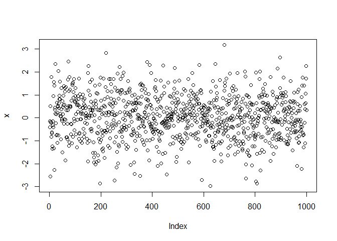
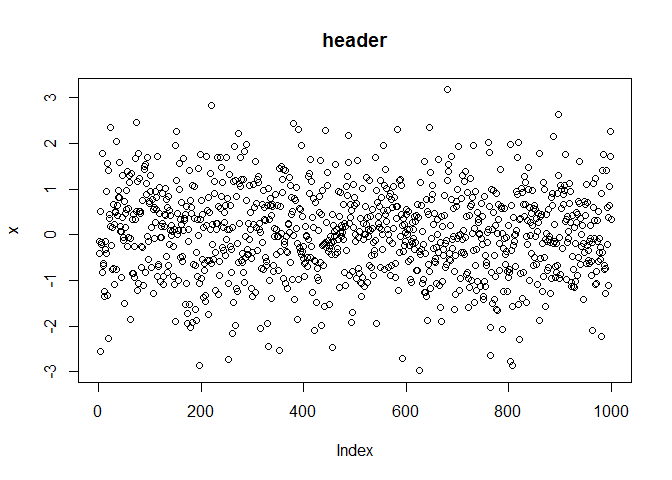
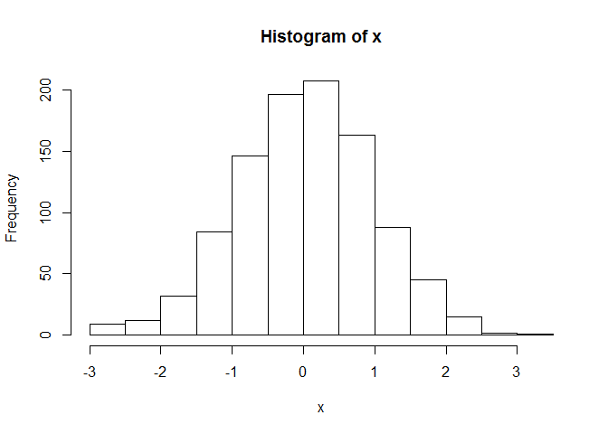
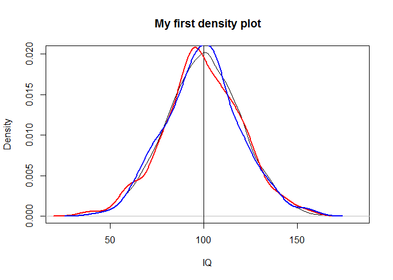
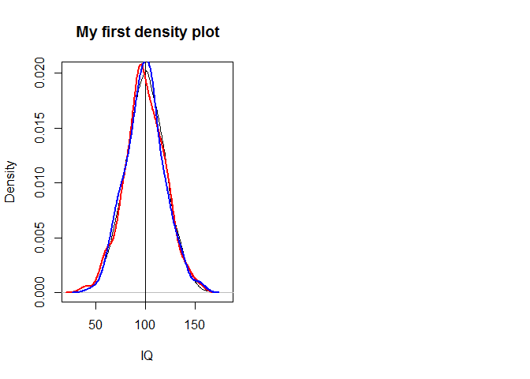
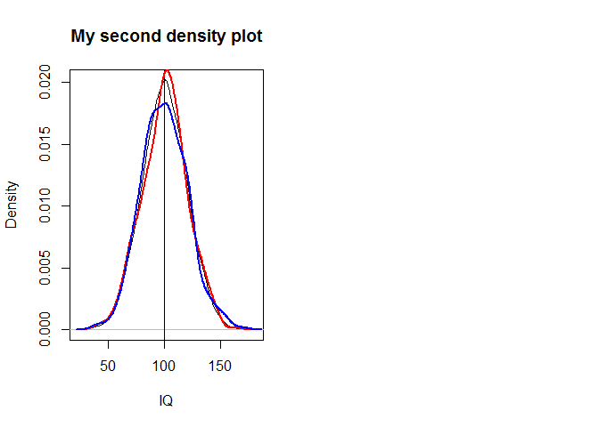

Introduction
------------

This document can be used for the preparation to the GRADE- workshop
"Sampling and Estimation" at the University of Frankfurt. Hints for
further reading are embedded at the end of each section.

Why use R?
----------

There are several arguments for the use of R as a tool for sampling and
estimation:

-   [Rapid
    implementation](https://opensource.com/business/14/12/r-open-source-language-data-science)
    of new (scientific) developments

-   [Quick development](http://r4stats.com/articles/popularity/) of new
    tools that fit the user's demand

-   Over 5,000
    [packages](http://www.r-statistics.com/2013/06/top-100-r-packages-for-2013-jan-may/)
    contributed by users available on
    [CRAN](http://mirrors.softliste.de/cran/)

-   [Open Source](https://en.wikipedia.org/wiki/Open-source_software) -
    You can create your own objects, functions and packages

-   [Reproducibility](http://www.r-bloggers.com/rs-role-in-science-breakthrough-reproducibility-of-psychology-studies/)

More arguments for the usage of R can be found
[here](http://www.nytimes.com/2009/01/07/technology/business-computing/07program.html?_r=2&)
or [here](http://www.revolutionanalytics.com/what-r).

How to get R?
-------------

R can be installed on Windows and Linux plattforms as well as on Macs.
If you have not done it already please download R from
[here](http://mirrors.softliste.de/cran/).

The installation process should be straightforward. If you have problems
you can read an
[introduction](http://a-little-book-of-r-for-time-series.readthedocs.org/en/latest/src/installr.html)
or watch an intro on
[youtube](https://www.youtube.com/watch?v=cX532N_XLIs).

Rstudio
-------

The basic R looks like this:

Most R-users prefer the graphical user interface
([GUI](https://en.wikipedia.org/wiki/Graphical_user_interface))

Several [GUI's](http://www.statmethods.net/interface/guis.html) are
available. In this course we will use the Rstudio [GUI](www.rstudio.com)
which can be downloaded
[here](https://www.rstudio.com/products/RStudio/#Desktop).

-   How to install Rstudio (
    [youtube](https://www.youtube.com/watch?v=MFfRQuQKGYg) |
    [dummies](http://www.dummies.com/how-to/content/how-to-install-and-configure-rstudio.html))

First operations
----------------

If you work with R you should work with scripts that should be [well
structured](http://nicercode.github.io/blog/2013-04-05-projects/) and
lucid. To re-use scripts it is necessary to comment the code with
hashes:

    # Comments 

Create [new
variables](http://www.statmethods.net/management/variables.html) with
the assignment operator `<-`:

    x <- 1 # numeric
    y <- "a" # string
    z <- T # logical

The following line creates a vector with ten standard-normal-distributed
values.

    x <- rnorm(10,0,1)

`rnorm` is a function which takes several arguments. More information on
assignments can be found
[here](https://cran.r-project.org/doc/manuals/r-release/R-intro.html#Vectors-and-assignment).

Functions
---------

    mean(x)

    ## [1] 0.2301037

calculates the mean of variable x

More basic commands:

    length(x)

    ## [1] 10

    max(x)

    ## [1] 2.691111

    min(x)

    ## [1] -1.906389

    sd(x)

    ## [1] 1.454892

    var(x)

    ## [1] 2.11671

    median(x)

    ## [1] 0.4797695

Errors and Warnings
-------------------

If an error occurs - you have to fix it:

    1/"a"

    a <- 5 
    1/a

    ## [1] 0.2

You should always read the warnings, but sometimes you can ignore them:

    library(sampling)

    ## Warning: package 'sampling' was built under R version 3.2.3

Getting help
------------

Countless introductions to R are available. The manuals on CRAN are
comprehensive.

-   [Introduction to
    R](http://mirrors.softliste.de/cran/doc/manuals/r-release/R-intro.html#Introduction-and-preliminaries)

-   [Thomas Girke - Programming in
    R](http://manuals.bioinformatics.ucr.edu/home/programming-in-r)

-   A collection of tutorial videos can be found
    [here](http://jeromyanglim.blogspot.de/2010/05/videos-on-data-analysis-with-r.html)

For more specific questions and solutions e.g. in respect of error
messages it is useful to use a [search engine](https://duckduckgo.com/).
Alternatively forums like
[stackoverflow](http://stackoverflow.com/questions/tagged/r) can be
used.

If you have problems to find the commands use a [reference
card](https://cran.r-project.org/doc/contrib/Short-refcard.pdf)

A basic help is always embedded in R. Get the help page for a command:

    help.start()

    help(mean)

      # if you know already the function name:
    ?mean

Often you can get examples like the following one for linear regression.

    example(lm)

Draw random numbers:
--------------------

In the following three different functions are used to draw random
numbers:

      # Uniform Distribution
    x1 <- runif(1000)
      # Normal distribution
    x2 <- rnorm(1000)
      # Exponential distribution
    x3 <- rexp(1000)

    rnorm(20,mean=0,sd=1)

    ##  [1]  1.39073662 -0.90957666 -1.74043353 -0.12606036  0.13923551
    ##  [6]  1.23343481 -0.46266631 -0.13668701  0.54858193  0.01075634
    ## [11]  0.41504850  1.31572939  1.48201788 -0.10640651  0.18708196
    ## [16] -1.46592059 -1.96876548  1.47593755 -1.45177093  1.08789903

Installing and Loading Packages
-------------------------------

Many functions are already implemented in basic R. For more specific
tasks libraries/packages have to be installed. This can be done using
the command `install.packages`. After the installation the package must
be loaded with the command `library`.

    install.packages("sampling")
    library("sampling")

Here is a list of packages which are relevant for the workshop:

-   [foreign](https://cran.r-project.org/web/packages/foreign/index.html) -
    Read Data Stored by Minitab, S, SAS, SPSS, Stata, Systat, Weka,
    dBase, ...

-   [sampling](https://cran.r-project.org/web/packages/sampling/index.html) -
    Survey Sampling

-   [survey](https://cran.r-project.org/web/packages/survey/index.html) -
    analysis of complex survey samples

-   [plyr](https://cran.r-project.org/web/packages/plyr/index.html) -
    Tools for Splitting, Applying and Combining Data

-   [Matrix](https://cran.r-project.org/web/packages/Matrix/index.html) -
    Sparse and Dense Matrix Classes and Methods

<!-- -->

    install.packages("foreign")
    install.packages("lattice")
    install.packages("survey")
    install.packages("plyr")
    install.packages("Matrix")

A list on the most popular R-packages can be found
[here](http://blog.revolutionanalytics.com/2013/06/a-list-of-r-packages-by-popularity.html).

Indexing
--------

[Indexing](https://cran.r-project.org/doc/manuals/r-release/R-lang.html#Indexing)
is an important concept, e.g. to select subgroups. In the following the
indexing for the different [data
types](http://www.statmethods.net/input/datatypes.html) are presented.

First indexing for vectors:

    A1 <- c(1,2,3,4)
    A1

    ## [1] 1 2 3 4

    A1[1]

    ## [1] 1

    A1[4]

    ## [1] 4

    A1[1:3]

    ## [1] 1 2 3

    A1[-4]

    ## [1] 1 2 3

Indexing for dataframes:

    AA <- 4:1
    A2 <- cbind(A1,AA)
    A2[1,1]

    ## A1 
    ##  1

    A2[2,]

    ## A1 AA 
    ##  2  3

    A2[,1]

    ## [1] 1 2 3 4

    A2[,1:2]

    ##      A1 AA
    ## [1,]  1  4
    ## [2,]  2  3
    ## [3,]  3  2
    ## [4,]  4  1

Indexing for arrays:

    A3 <- array(1:8,c(2,2,2))
    A3

    ## , , 1
    ## 
    ##      [,1] [,2]
    ## [1,]    1    3
    ## [2,]    2    4
    ## 
    ## , , 2
    ## 
    ##      [,1] [,2]
    ## [1,]    5    7
    ## [2,]    6    8

    A3[,,2]

    ##      [,1] [,2]
    ## [1,]    5    7
    ## [2,]    6    8

Indexing for list's:

    A4 <- list(A1,1)
    A4

    ## [[1]]
    ## [1] 1 2 3 4
    ## 
    ## [[2]]
    ## [1] 1

    A4[[2]]

    ## [1] 1

Sequences
---------

    # sequence from 1 to 10
    1:10

    ##  [1]  1  2  3  4  5  6  7  8  9 10

    seq(-2,8,by=1.5)

    ## [1] -2.0 -0.5  1.0  2.5  4.0  5.5  7.0

    a<-seq(3,12,length=12)

    b<- seq(to=5,length=12,by=0.2)

    d <-1:10
    d<- seq(1,10,1)
    d <- seq(length=10,from=1,by=1)

    # replicate 1 10 times
    rep(1,10)

    ##  [1] 1 1 1 1 1 1 1 1 1 1

    rep("A",10)

    ##  [1] "A" "A" "A" "A" "A" "A" "A" "A" "A" "A"

[Basic Visualisations](http://www.statmethods.net/graphs/)
----------------------------------------------------------

The plot function is the easiest option to get a graphic:

    x <- rnorm(1000,0,1)
    plot(x)

Adding a header:

    plot(x,main="header")

If we want a histogram, we can use the following command:

    hist(x)

The sample function
-------------------

Usage of the command
[sample](https://stat.ethz.ch/R-manual/R-devel/library/base/html/sample.html)

    sample(x=1:10,1)

    ## [1] 2

    sample(x=1:10,1,replace=T)

    ## [1] 8

Working Directory and Workspace
-------------------------------

Declaring a working directory (you need to tell R where your data is
saved).

    path<-"C:/"

    setwd(path)

    getwd()

    dir()

-   It is always useful to define and set your working directory at the
    beginning of each script
-   `getwd()` displays you your current working directory
-   `dir()` shows you all objects in a specific directory
-   `ls()` lists all objects in your workspace
-   `rm()` removes a object from your workspace

<!-- -->

    rm(list = ls()) # deletes all objects in your current workspace

[Data Import and Export in R](http://science.nature.nps.gov/im/datamgmt/statistics/r/fundamentals/index.cfm)
------------------------------------------------------------------------------------------------------------

Some datasets are implemented in R-packages:

    library("sampling")
    data(belgianmunicipalities)

    head(belgianmunicipalities)

<table>
<thead>
<tr class="header">
<th align="left">Commune</th>
<th align="right">INS</th>
<th align="right">Province</th>
<th align="right">Arrondiss</th>
<th align="right">Men04</th>
</tr>
</thead>
<tbody>
<tr class="odd">
<td align="left">Aartselaar</td>
<td align="right">11001</td>
<td align="right">1</td>
<td align="right">11</td>
<td align="right">6971</td>
</tr>
<tr class="even">
<td align="left">Anvers</td>
<td align="right">11002</td>
<td align="right">1</td>
<td align="right">11</td>
<td align="right">223677</td>
</tr>
<tr class="odd">
<td align="left">Boechout</td>
<td align="right">11004</td>
<td align="right">1</td>
<td align="right">11</td>
<td align="right">6027</td>
</tr>
<tr class="even">
<td align="left">Boom</td>
<td align="right">11005</td>
<td align="right">1</td>
<td align="right">11</td>
<td align="right">7640</td>
</tr>
<tr class="odd">
<td align="left">Borsbeek</td>
<td align="right">11007</td>
<td align="right">1</td>
<td align="right">11</td>
<td align="right">4948</td>
</tr>
<tr class="even">
<td align="left">Brasschaat</td>
<td align="right">11008</td>
<td align="right">1</td>
<td align="right">11</td>
<td align="right">18142</td>
</tr>
<tr class="odd">
<td align="left">Brecht</td>
<td align="right">11009</td>
<td align="right">1</td>
<td align="right">11</td>
<td align="right">12975</td>
</tr>
<tr class="even">
<td align="left">Edegem</td>
<td align="right">11013</td>
<td align="right">1</td>
<td align="right">11</td>
<td align="right">10614</td>
</tr>
</tbody>
</table>

Also foreign datasets can be imported:

    link <- "https://raw.githubusercontent.com/BernStZi/
    SamplingAndEstimation/master/excercise/data/my.pop.csv"

    my.pop <- read.csv(link)

    head(my.pop)

<table>
<thead>
<tr class="header">
<th align="right">X</th>
<th align="right">id</th>
<th align="left">gender</th>
<th align="left">education</th>
<th align="right">iq</th>
</tr>
</thead>
<tbody>
<tr class="odd">
<td align="right">1</td>
<td align="right">1</td>
<td align="left">male</td>
<td align="left">high</td>
<td align="right">123.26218</td>
</tr>
<tr class="even">
<td align="right">2</td>
<td align="right">2</td>
<td align="left">male</td>
<td align="left">none</td>
<td align="right">96.19531</td>
</tr>
<tr class="odd">
<td align="right">3</td>
<td align="right">3</td>
<td align="left">male</td>
<td align="left">low</td>
<td align="right">94.21088</td>
</tr>
<tr class="even">
<td align="right">4</td>
<td align="right">4</td>
<td align="left">female</td>
<td align="left">high</td>
<td align="right">92.02308</td>
</tr>
<tr class="odd">
<td align="right">5</td>
<td align="right">5</td>
<td align="left">male</td>
<td align="left">average</td>
<td align="right">114.18485</td>
</tr>
<tr class="even">
<td align="right">6</td>
<td align="right">6</td>
<td align="left">male</td>
<td align="left">average</td>
<td align="right">67.54705</td>
</tr>
</tbody>
</table>

In the following the European Social Survey (ESS) data will be used. The
data can be downloaded
[here](http://www.europeansocialsurvey.org/data/round-index.html). We
can import spss data using the command `read.spss` from R-package
`foreign`.

    library(foreign)
    ESS7 <- read.spss("ESS7e01.sav",to.data.frame=T)

As default the data is imported as a list but it is more convenient to
work with `data.frames`. Therefore we have to specify in a further
argument, that we want to work with a `data.frame`.

With the package `foreign`it is also possible to import stata-data:

    library(foreign)
    ESS7s <- read.dta("ESS7e01.dta")

In the first example a country file and sample data for Sweden will be
needed.

    library(foreign)
    ESS5_SE <- read.spss("ESS5_SE_SDDF.por",
                         to.data.frame=T)

Some Links on import and export of data in R:

-   [Quick-R on importing
    data](http://www.statmethods.net/input/importingdata.html)

-   [Quick-R on exporting
    data](http://www.statmethods.net/input/exportingdata.html)

[Subsetting Data](http://www.statmethods.net/management/subset.html)
--------------------------------------------------------------------

Select the first 100 rows of a dataset and assign the information to a
new object `bgm`:

    library("sampling")
    data(belgianmunicipalities)
    bgm <- belgianmunicipalities[1:100,]

Select only the entries for the first province:

    bgm1 <- belgianmunicipalities[
      belgianmunicipalities$Province==1,]

Select only Communes with a total population bigger than 20000:

    bgm20 <- belgianmunicipalities[
      belgianmunicipalities$Tot04>20000,]

Merging
-------

If you are not sure on the usage of a command, it is always useful to
have a look at the help page of the command. E.g. we need to use the
command `merge` to combine datasets. There is a section `Example` at the
end of each helpfile. You get the helpfile with:

    ?merge

There you will find code which can be copy-pasted to the console:

Use the following lines of code to produce a `data.frame` authors:

    authors <- data.frame(
        surname = I(c("Tukey", "Venables", "Tierney", "Ripley", "McNeil")),
        nationality = c("US", "Australia", "US", "UK", "Australia"),
        deceased = c("yes", rep("no", 4)))

Use the following lines of code to produce a `data.frame` books:

    books <- data.frame(
        name = I(c("Tukey", "Venables", "Tierney",
                 "Ripley", "Ripley", "McNeil", "R Core")),
        title = c("Exploratory Data Analysis",
                  "Modern Applied Statistics ...",
                  "LISP-STAT",
                  "Spatial Statistics", "Stochastic Simulation",
                  "Interactive Data Analysis",
                  "An Introduction to R"),
        other.author = c(NA, "Ripley", NA, NA, NA, NA,
                         "Venables & Smith"))

Merge the do `data.frames` authors and books:

    m1 <- merge(authors, books, by.x = "surname", by.y = "name")

    head(m1)

<table>
<thead>
<tr class="header">
<th align="left">surname</th>
<th align="left">nationality</th>
<th align="left">deceased</th>
<th align="left">title</th>
<th align="left">other.author</th>
</tr>
</thead>
<tbody>
<tr class="odd">
<td align="left">McNeil</td>
<td align="left">Australia</td>
<td align="left">no</td>
<td align="left">Interactive Data Analysis</td>
<td align="left">NA</td>
</tr>
<tr class="even">
<td align="left">Ripley</td>
<td align="left">UK</td>
<td align="left">no</td>
<td align="left">Spatial Statistics</td>
<td align="left">NA</td>
</tr>
<tr class="odd">
<td align="left">Ripley</td>
<td align="left">UK</td>
<td align="left">no</td>
<td align="left">Stochastic Simulation</td>
<td align="left">NA</td>
</tr>
<tr class="even">
<td align="left">Tierney</td>
<td align="left">US</td>
<td align="left">no</td>
<td align="left">LISP-STAT</td>
<td align="left">NA</td>
</tr>
<tr class="odd">
<td align="left">Tukey</td>
<td align="left">US</td>
<td align="left">yes</td>
<td align="left">Exploratory Data Analysis</td>
<td align="left">NA</td>
</tr>
<tr class="even">
<td align="left">Venables</td>
<td align="left">Australia</td>
<td align="left">no</td>
<td align="left">Modern Applied Statistics ...</td>
<td align="left">Ripley</td>
</tr>
</tbody>
</table>

A first example dataset
-----------------------

The first example dataset is a synthetic example. For more information
on the generation of this dataset see the r-code
[here](https://raw.githubusercontent.com/BernStZi/SamplingAndEsimation/master/excercise/rcode/SampEst_GenerateExdata.R).

    link <- "https://raw.githubusercontent.com/BernStZi/
    SamplingAndEsimation/master/excercise/data/my.pop.csv"

    my.pop <- read.csv(link)

    head(my.pop)

<table>
<thead>
<tr class="header">
<th align="right">X</th>
<th align="right">id</th>
<th align="left">gender</th>
<th align="left">education</th>
<th align="right">iq</th>
</tr>
</thead>
<tbody>
<tr class="odd">
<td align="right">1</td>
<td align="right">1</td>
<td align="left">male</td>
<td align="left">high</td>
<td align="right">123.26218</td>
</tr>
<tr class="even">
<td align="right">2</td>
<td align="right">2</td>
<td align="left">male</td>
<td align="left">none</td>
<td align="right">96.19531</td>
</tr>
<tr class="odd">
<td align="right">3</td>
<td align="right">3</td>
<td align="left">male</td>
<td align="left">low</td>
<td align="right">94.21088</td>
</tr>
<tr class="even">
<td align="right">4</td>
<td align="right">4</td>
<td align="left">female</td>
<td align="left">high</td>
<td align="right">92.02308</td>
</tr>
<tr class="odd">
<td align="right">5</td>
<td align="right">5</td>
<td align="left">male</td>
<td align="left">average</td>
<td align="right">114.18485</td>
</tr>
<tr class="even">
<td align="right">6</td>
<td align="right">6</td>
<td align="left">male</td>
<td align="left">average</td>
<td align="right">67.54705</td>
</tr>
</tbody>
</table>

The dollar sign can also be used to access the columns

    head(my.pop$gender)

    ## [1] male   male   male   female male   male  
    ## Levels: female male

With the command `table` we get a contingency table:

    table(my.pop$gender)

    ## 
    ## female   male 
    ##   5125   4875

With `prop.table` we get the relative frequencies:

    tabA <- table(my.pop$gender)
    prop.table(tabA)

    ## 
    ## female   male 
    ## 0.5125 0.4875

Apply family
------------

Apply functions over array margins, ragged arrays or lists. To show that
we first need an example data set:

    ApplyDat <- cbind(1:4,runif(4),rnorm(4))

To compute the mean for every row, we can use the `apply` command.

    apply(ApplyDat,1,mean)

    ## [1] 0.3996026 1.0394160 1.3441235 1.3416313

Mean for every column:

    apply(ApplyDat,2,mean)

    ## [1] 2.50000000 0.50843090 0.08514919

Simple Example on Sampling
--------------------------

Summary of the dataset:

    summary(my.pop)

    ##        X               id           gender       education   
    ##  Min.   :    1   Min.   :    1   female:5125   average:2851  
    ##  1st Qu.: 2501   1st Qu.: 2501   male  :4875   high   :2820  
    ##  Median : 5000   Median : 5000                 low    :3588  
    ##  Mean   : 5000   Mean   : 5000                 none   : 741  
    ##  3rd Qu.: 7500   3rd Qu.: 7500                               
    ##  Max.   :10000   Max.   :10000                               
    ##        iq        
    ##  Min.   : 30.93  
    ##  1st Qu.: 86.50  
    ##  Median :100.08  
    ##  Mean   :100.02  
    ##  3rd Qu.:113.60  
    ##  Max.   :173.26

    prop.table(table(my.pop$gender,my.pop$education))

    ##         
    ##          average   high    low   none
    ##   female  0.1449 0.1465 0.1844 0.0367
    ##   male    0.1402 0.1355 0.1744 0.0374

    var(my.pop$iq)*(nrow(my.pop)-1)/nrow(my.pop)

    ## [1] 406.1684

In the following example two simple random samples are drawn, one with
replacement and one without replacement:

    s.SRS <- sample(1:nrow(my.pop),500,replace=T)
    s.SRSWOR <- sample(1:nrow(my.pop),500,replace=F)

    my.samp.SRS <- my.pop[s.SRS,]
    my.samp.SRSWOR <- my.pop[s.SRSWOR,]
    summary(my.samp.SRS)

    ##        X              id          gender      education         iq        
    ##  Min.   :  12   Min.   :  12   female:248   average:144   Min.   : 46.87  
    ##  1st Qu.:2422   1st Qu.:2422   male  :252   high   :130   1st Qu.: 86.74  
    ##  Median :5200   Median :5200                low    :194   Median :102.03  
    ##  Mean   :5136   Mean   :5136                none   : 32   Mean   :100.93  
    ##  3rd Qu.:7885   3rd Qu.:7885                              3rd Qu.:114.23  
    ##  Max.   :9975   Max.   :9975                              Max.   :173.26

Making graphics to compare the samples:

    plot(density(my.pop$iq),main = "My first density plot"
         , xlab = "IQ")
    abline(v=mean(my.pop$iq), col = "black")
    lines(density(my.samp.SRS$iq),col = "red",lwd=2)
    lines(density(my.samp.SRSWOR$iq),col = "blue",lwd=2)

The package `sampling` is very useful to draw samples. An introduction
to the package can be found
[here](http://home.lu.lv/~pm90015/workshop2006/papers/presentations/W2006_Presentation_27_Tille.pdf).

    library("sampling")
    s.SRS1 <- srswr(500,nrow(my.pop))
    s.SRSWOR1 <- srswor(500,nrow(my.pop)) 
    my.samp.SRS1 <- rbind(my.pop[s.SRS1!=0,]
                          ,my.pop[s.SRS1>1,])
    my.samp.SRSWOR1 <- my.pop[s.SRSWOR1==1,]

    par(mfrow=c(1,2))
    plot(density(my.pop$iq),main = "My first density plot"
         , xlab = "IQ")
    abline(v=mean(my.pop$iq), col = "black")
    lines(density(my.samp.SRS$iq),col = "red",lwd=2)
    lines(density(my.samp.SRSWOR$iq),col = "blue",lwd=2)

    par(mfrow=c(1,2))
    plot(density(my.pop$iq),main = "My second density plot"
         , xlab = "IQ")
    abline(v=mean(my.pop$iq), col = "black")
    lines(density(my.samp.SRS1$iq),col = "red",lwd=2)
    lines(density(my.samp.SRSWOR1$iq),col = "blue",lwd=2)

-   should yield same results
-   routine may differ because of "starting point"

Links and resources for the workshop
------------------------------------

-   Kerns - [Introduction to Probability and Statistics Using
    R](https://cran.r-project.org/web/packages/IPSUR/vignettes/IPSUR.pdf)

-   Sharon Lohr (1999) - [Sampling: Design and
    Analysis](http://www.math.zju.edu.cn/webpagenew/uploadfiles/attachfiles/201335142847631.pdf)

-   Ganninger - [Design effects model-based versus design-based
    approach](http://www.ssoar.info/ssoar/bitstream/handle/document/26124/ssoar-2010-ganninger-design_effects_model-based_versus_design-based.pdf?sequence=1)
